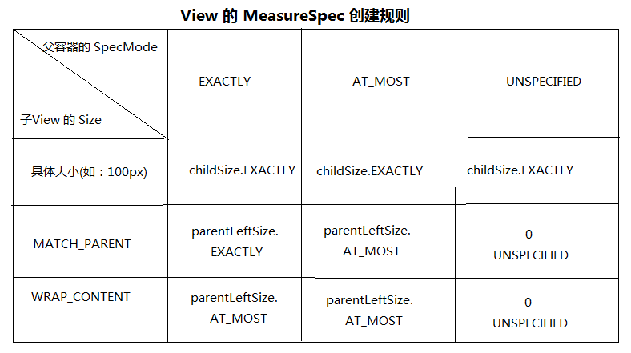
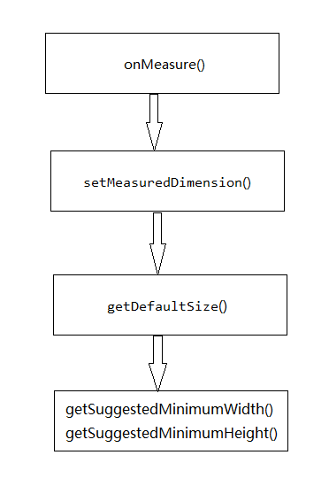

# 课时1：自定义 View #
1. 自定义 View 的初步认识
2. measure 源码分析
3. layout 的实现
4. draw 画各种图形
5. 自定义 View 示例
6. Touch 事件的感性认识
7. onTouch onTouchEvent onClick 的关系
8. disPatchTouchEvent onIntercepteTouchEvent onTouchEvent 源码
9. 弄清楚几个问题
10. 滑动冲突的完整示例

# 课时1-2：常用工具介绍 #
1. Configuration - 
2. ViewConfiguration
3. GestureDetector - 手势监测
4. VelocityTracker - 速度追踪
5. Scroller 
6. ViewDragHelper - View 拖拽

## 1. Configuration ##
### 1. 用来描述设备的配置信息 ###
1. 比如用户的配置信息：locale 和 scaling
2. 比如设备的相关信息：
	1. 输入模式
	2. 屏幕大小
	3. 屏幕方向

### 2. 示例代码 ###
1. 获得一个 Configuration

		/**获取一个 configuration*/
        Configuration configuration = getResources().getConfiguration();
        
        /**获取国家码*/
        int countryCode = configuration.mcc;
        
        /**获取网络码*/
        int netWorkCode = configuration.mnc;
        
        /**判断横竖屏*/
        if (configuration.orientation == configuration.ORIENTATION_PORTRAIT) {

        } else {
            
        } 

## 2. ViewConfiguration ##
### 1. 提供一些自定义控件用到的标准常量： ###
1. 比如：
	1. UI 超时
	2. 尺寸大小
	3. 滑动距离
	4. 敏感度

### 2. ViewConfiguration 的示例获取 ###
1. ViewConfiguration 常用对象方法

		 /**ViewConfiguration 常用对象方法*/
        ViewConfiguration viewConfiguration = ViewConfiguration.get(context);
        
        /**获取 touchSlop
         * - 系统所能识别滑动的最小距离
         * - 手指滑动的距离 > touchSlop 系统认为是滑动
         */
        int touchSlop = viewConfiguration.getScaledTouchSlop();
        
        /**获取 Fling 速度的最小值和最大值*/
        int minimumVelocity = viewConfiguration.getScaledMinimumFlingVelocity();
        int maximumVelocity = viewConfiguration.getScaledMaximumFlingVelocity();
        
        /**判断是否有物理按键
         * - 占用屏幕空间 
         */
        boolean isHavePermanentMenuKey = viewConfiguration.hasPermanentMenuKey();

2. ViewConfiguration 常用静态方法*

		/**ViewConfiguration 常用静态方法*/
        ViewConfiguration viewConfiguration = ViewConfiguration.get(context);
        
        /**双击间隔时间
         * - 在改时间内是双击
         * - 否则是单击
         */
        int doubleTapTimeout = ViewConfiguration.getDoubleTapTimeout();
        
        /**按住状态转变为长按状态需要的时间*/
        int longPressTimeout = ViewConfiguration.getLongPressTimeout();
        
        /**重复按键的时间*/
        int keyRepeatTimeout = ViewConfiguration.getKeyRepeatTimeout();
          

## 3. GestureDetector ##
### 1. 主要作用简化 Touch 操作 ###

### 2. 示例代码 ###
1. 第一步：实现OnGestureListener
2. 第二步：生成GestureDetector对象
3. 第三步：将Touch事件交给GestureDetector处理 

		public class GestureListenenrImpl implements GestureDetector.OnGestureListener {
    
	    /**触摸屏幕时均会调用该方法*/
	    @Override
	    public boolean onDown(MotionEvent motionEvent) {
	        Log.e("TAG", "onDown --- 触摸屏幕");
	        return false;
	    }
	
	    /**手指在屏幕上按下，且未移动和松开时调用该方法*/
	    @Override
	    public void onShowPress(MotionEvent motionEvent) {
	        Log.e("TAG", "onShowPress --- 按下不移动，松开");
	    }
	
	    /**轻击屏幕时调用该方法*/
	    @Override
	    public boolean onSingleTapUp(MotionEvent motionEvent) {
	        Log.e("TAG", "onSingleTapUp --- 轻击屏幕");
	        return false;
	    }
	
	    /**手指在屏幕上滑动时会调用该方法*/
	    @Override
	    public boolean onScroll(MotionEvent motionEvent, MotionEvent motionEvent1, float v, float v1) {
	        Log.e("TAG", "onScroll --- 手指滑动");
	        return false;
	    }
	
	    /**手指长按屏幕时均会调用该方法*/
	    @Override
	    public void onLongPress(MotionEvent motionEvent) {
	        Log.e("TAG", "onLongPress --- 长按屏幕");
	    }
	
	    /**手指在屏幕上拖动时均会调用该方法*/
	    @Override
	    public boolean onFling(MotionEvent motionEvent, MotionEvent motionEvent1, float v, float v1) {
	        Log.e("TAG", "onFling --- 拖动");
	        return false;
	    }

## 4. VelocityTracker ##
### 1. 用于跟踪触摸屏事件的速率 ###

### 2. 示例代码 ###
1. 开始追踪

		private void startVelocityTracker(MotionEvent event) {  
	    if (mVelocityTracker == null) {  
	         mVelocityTracker = VelocityTracker.obtain();  
	     }  
	     mVelocityTracker.addMovement(event);  
		}  
	- 在这里我们初始化VelocityTracker，并且把要追踪的MotionEvent注册到VelocityTracker的监听中。
	
2. 获取速度

		private int getScrollVelocity() {  
	     // 设置VelocityTracker单位.1000表示1秒时间内运动的像素  
	     mVelocityTracker.computeCurrentVelocity(1000);  
	     // 获取在1秒内X方向所滑动像素值  
	     int xVelocity = (int) mVelocityTracker.getXVelocity();  
	     return Math.abs(xVelocity);  
	    } 

3. 停止追踪，释放
	
		private void stopVelocityTracker() {  
		     if (mVelocityTracker != null) {  
		         mVelocityTracker.recycle();  
		         mVelocityTracker = null;  
		      }  
		}  

## 5. Scroller  ##
### 1. 实现View平滑滚动的一个Helper类 ###
1. 通常在自定义的View时使用
2. 在View中定义一个私有成员mScroller = new Scroller(context)。
3. 设置mScroller滚动的位置时，并不会导致View的滚动，
4. 通常是用mScroller记录/计算View滚动的位置，
5. 再重写View的computeScroll()，完成实际的滚动。 

### 2. 示例代码 ###

### 3. scrollTO() 和 scrollBy() 的关系 ###
1. scrollBy() 的源码：

		public void scrollBy(int x, int y) {   
      		scrollTo(mScrollX + x, mScrollY + y);   
		} 
		
	- 在 scrollBy() 中，最终调用 scrollTo() 方法
	- 最终起作用的就是 scrollTo() 方法
	- scrollBy() 对 scrollTo() 进行了封装
	
### 2. scroll 的本质 ###
	1. 滑动的只是滑动 View 的内容
	2. View 的背景是不移动的
	
### 3. scrollTo() 和 scrollBy() 方法的坐标说明 ###
1. 通过 Demo 验证
2. 查看源码

## 6. ViewDragHelper ##
### 1. 主要作用简化 View 的拖拽相关操作 ###
1. 在自定义ViewGroup中，很多效果都包含用户手指去拖动其内部的某个View(eg:侧滑菜单等)，
2. 针对具体的需要去写好onInterceptTouchEvent和onTouchEvent这两个方法是一件很不容易的事，需要自己去处理：多手指的处理、加速度检测等等。

### 2. 示例代码 ###
1. 创建实例
2. 触摸相关方法
3. 实现 ViewDragHelper.CallBack() 

		/**初始化 ViewDragHelper*/
   		private void initViewDragHelper() {
        ViewDragHelper mViewDragHelper = ViewDragHelper.create(this, 0.0f,
                new ViewDragHelper.Callback() {
                    @Override
                    public boolean tryCaptureView(View child, int pointerId) {
                        return true;
                    }

                    /**处理水平方向越界*/
                    @Override
                    public int clampViewPositionHorizontal(View child, int left, int dx) {
                        int fixdLeft;
                        View parent = (View) child.getParent();
                        int leftBound = parent.getPaddingLeft();
                        int rightBound = parent.getWidth() - child.getWidth() - parent.getPaddingRight();

                        if (left < leftBound) {
                            fixdLeft = leftBound;
                        } else if (left > leftBound) {
                            fixdLeft = rightBound;
                        } else {
                            fixdLeft = left;
                        }

                        return fixdLeft;
                    }

                    /**处理竖直方向的越界*/
                    @Override
                    public int clampViewPositionVertical(View child, int top, int dy) {
                        int fixedTop;
                        View parent = (View) child.getParent();
                        int topBound = getPaddingTop();
                        int bottomBound = getHeight() - child.getHeight() - parent.getPaddingBottom();
                        if (top < topBound) {
                            fixedTop = topBound;
                        } else if (top > bottomBound) {
                            fixedTop = bottomBound;
                        } else {
                            fixedTop = top;
                        }

                        return fixedTop;
                    }

                    /**监听拖动状态的改变*/
                    @Override
                    public void onViewDragStateChanged(int state) {
                        super.onViewDragStateChanged(state);
                        switch (state) {
                            case ViewDragHelper.STATE_DRAGGING:
                                Log.d("TAG", "STATE_DRAGGING");
                                break;
                            case ViewDragHelper.STATE_IDLE:
                                Log.d("TAG", "STATE_IDLE");
                                break;
                            case ViewDragHelper.STATE_SETTLING:
                                Log.d("TAG", "STATE_SETTLING");
                                break;

                        }
                    }

                    /**捕获 View*/
                    @Override
                    public void onViewCaptured(View capturedChild, int activePointerId) {
                        super.onViewCaptured(capturedChild, activePointerId);
                        Log.d("TAG", "ViewCaptured");

                    }

                    /**释放 View*/
                    @Override
                    public void onViewReleased(View releasedChild, float xvel, float yvel) {
                        super.onViewReleased(releasedChild, xvel, yvel);
                        Log.d("TAG", "ViewReleased");

                    }
                });
	    }
	
	    /**将拦截事件交给 ViewDragHelper 处理*/
	    @Override
	    public boolean onInterceptHoverEvent(MotionEvent event) {
	        return mViewDragHelper.shouldInterceptTouchEvent(event);
	    }
	
	    /**将 Touch 事件交给 ViewDragHelper 处理*/
	    @Override
	    public boolean onTouchEvent(MotionEvent event) {
	        mViewDragHelper.processTouchEvent(event);
	        return true;
	    }

### 3. ViewDragHelper 小结： ###
1. ViewDragHelper 是作用在 ViewGroup上的(比如：Linearlayout),而不是直接作用到某个被拖动的字 View
	- 子 View，在布局中的位置是其所在的 ViewGroup 决定的

2. 示例代码中 ViewDragHelper 做了如下主要操作
	1. VDH 接管了 ViewGroup 的事件拦截
	2. VDH 接管了 ViewG 的Touch 事件
	3. VDH 处理了拖拽子 View 时的边界越界
	4. VDH 监听了拖拽子 View 时的变化
	5. 还可以实现：抽屉拉伸，拖拽结束后子 View 自动归位

# 课时2：onMeasure 源码分析 #
## 1. MeasureSpec ##
### 1. 基础知识简介 ###
1. 系统显示一个 View，首先需要通过测量(measure 操作)该 View 来知晓其长和宽从而确定显示该 View 时需要多大的空间
2. 在测量的过程中 MessureSpec 贯穿全程，发挥着不可或缺的作用
### 2. 官方文档对 MeasureSpec 的介绍##
1. MeasureSpec 封装了父布局传递给子布局的要求
2. MeasureSpec 可以表示宽和高
3. MeasureSpec 由 size 和 mode 组成
### 3. MeasureSpec 通常翻译为"测量规格" ###
1. 高2位代表　SpecMode 即某种测量模式；低30位为 SpecSize 代表在该模式下的规格太小
2. 通过如下方式分别获取这两个值：
	1. 获取 SpecSize
			
			int specSize = View.MeasureSpec.getSize(measureSpec);
	2. 获取 SpecMode

	        int specMode = View.MeasureSpec.getMode(measureSpec)
	3. 通过这两个值生成新的 MeasureSpec

			int measureSpec = View.MeasureSpec.makeMeasureSpec(size, mode);
#### 1. SpecMode 一共有三种： ####
1. **MeasureSpec.EXACTLY**
	1. 父容器已经检测出子 View 所需要的精确大小
	2. 在该模式下，View 的测量大小即为 SpecSize
2. **MeasureSpec.AT_MOST**
	1. 父容器未能检测出子 View 所需要的精确大小
	2. 但是，指定了一个可用大小即 specSize
	3. 在该模式下，View 的测量大小不能超过 SpecSize
3. **MeasureSpec.UNSPECIFIED**
	1. 父容器不对子容器的大小作限制
	2. 该模式一般作为 Android 系统内部，或者 ListView 和 ScrollView 等滑动控件
	3. 在此，不做探讨

#### 2. SpecMode 三种模式，源码分析 ####
1. 在 ViewGroup 中测量子 View 时会调用到 measureChildWithMargins() 方法，或者与之类似的方法，源码如下：

		/**
	     * @param child The child to measure
	     * @param parentWidthMeasureSpec The width requirements for this view
	     * @param widthUsed Extra space that has been used up by the parent
	     *        horizontally (possibly by other children of the parent)
	     * @param parentHeightMeasureSpec The height requirements for this view
	     * @param heightUsed Extra space that has been used up by the parent
	     *        vertically (possibly by other children of the parent)
	     */
   		 protected void measureChildWithMargins(View child,//子 View
		                                           int parentWidthMeasureSpec,// 父容器的宽的 MeasureSpec
		                                           int widthUsed,//父容器在水平方向已经占用的空间大小
		                                           int parentHeightMeasureSpec,// 父容器的高的 MeasureSpec
		                                           int heightUsed//父容器在垂直方向已经占用的空间大小
		    ) {
		/**1. 得到子 View 的 layoutParams*/
        final MarginLayoutParams lp = (MarginLayoutParams) child.getLayoutParams();

       	/**2. 得到子 View 宽的 MeasureSpec
         * mPaddingLeft 和 mPaddingLeft 表示父容器左右两内侧的 padding
         * lp.leftMargin 和 lp.rightMargin 表示子 View 左右两外侧的 margin
         * 这些值都不可以再利用起来布局子 View，
         * so：这些值得和表示：父容器在水平或垂直方向已被占用的空间
         * 
         */
        final int childWidthMeasureSpec = getChildMeasureSpec(parentWidthMeasureSpec,
                mPaddingLeft + mPaddingRight + lp.leftMargin + lp.rightMargin
                        + widthUsed, lp.width);

        /**3. 得到子 View 高的 MeasureSpec*/
        final int childHeightMeasureSpec = getChildMeasureSpec(parentHeightMeasureSpec,
                mPaddingTop + mPaddingBottom + lp.topMargin + lp.bottomMargin
                        + heightUsed, lp.height);

        /**4. 测量子 View*/
        child.measure(childWidthMeasureSpec, childHeightMeasureSpec);
	    }

2. 通过这些参数可以看出，该方法要测量子 View 传进来的参数却包含：
	1. 父容器的宽的 MeasureSpec
	2. 父容器在水平方向已经占用的空间大小
	3. 父容器的高的 MeasureSpec
	4. 父容器在垂直方向已经占用的空间大小

	这在一定程度上体现了：父 View 在一定程度上影响着子 View 的 Mea 的生成

3. 该方法的四步操作如上注释，第二步和第三步都调用到了 getChildMeasureSpec()
4. getChildMeasureSpec() 方法内部分析:

		 /**
	     * @param spec The requirements for this view
	     * @param padding The padding of this view for the current dimension and
	     *        margins, if applicable
	     * @param childDimension How big the child wants to be in the current
	     *        dimension
	     * @return a MeasureSpec integer for the child
	     */
	    public static int getChildMeasureSpec(int spec, //父容器的宽或高的 MeasureSpec
	                                          int padding, // 父容器在垂直方向或者水平方向已被占用的空间
	                                          int childDimension //
	    ) {
	
	
	
	
	        /**得到父容器的 specMode*/
	        int specMode = MeasureSpec.getMode(spec);
	
	        /**得到父容器的 specSize*/
	        int specSize = MeasureSpec.getSize(spec);
	
	        /**得到父容器在水平方向或垂直方向可用的最大空间值*/
	        int size = Math.max(0, specSize - padding);
	
	        int resultSize = 0;
	        int resultMode = 0;
	
	        /**确定子 View 的 specMode 和 specSize
	         * ----------------------------------
	         * 该 switch 语句的判断条件就是父 View 的 specMode,
	         * 在此，根据父 View 的 specMode 的不同来决定子 View 的 specMode 和 specSize
	         */
	        switch (specMode) {
	            /**
	             * 第一个 if：
	             *      childDimension >= 0 是什么？还有 < 0 的情况？
	             *      注意两个系统常量:
	             *      LayoutParams.MATCH_PARENT = -1,
	             *      LayoutParams.WRAP_CONTENT = -2
	             *      所以，在此处的代码 >= 0 ,表示：
	             *          1. 子 View 的宽或高不是 match_parent,也不是wrap_content
	             *          2. 而是一个具体的数值，比如说：100px
	             *          3. 那么子 View 的 size 就是 childDimension
	             *          4. 子 View 的 mode 也为 MeasureSpec.EXACTLY
	             *          5. 即：
	             *              resultSize = childDimension;
	             *              resultMode = MeasureSpec.EXACTLY;
	             *
	             * 第一个 else if:
	             *      表示子 View 的宽或高是 layoutParams.MATCH_PARENT
	             *      那么，子 View 的 size 就是 父容器在水平方向或垂直方向的最大空间值，即：size
	             *      子 View 的 mode 也为父容器的 mode， 即：
	             *          resultSize = size;
	             *          resultMode = MeasureSpec.EXACTLY;
	             *
	             * 第二个 else if:
	             *      表示子 View 的宽或高是 LayoutParams.WRAP_CONTENT
	             *      那么：子 View 的 size 就是父容器在水平方向或垂直方向的最大空间值，即：size
	             *      子 View 的 mode 为 MeasureSpec.AT_MOST,即：
	             *          resultSize = size;
	             *          resultMode = MeasureSpec.AT_MOST;
	             *
	             */
	            case MeasureSpec.EXACTLY:
	                if (childDimension >= 0) {
	                    resultSize = childDimension;
	                    resultMode = MeasureSpec.EXACTLY;
	                } else if (childDimension == LayoutParams.MATCH_PARENT) {
	                    // Child wants to be our size. So be it.
	                    resultSize = size;
	                    resultMode = MeasureSpec.EXACTLY;
	                } else if (childDimension == LayoutParams.WRAP_CONTENT) {
	                    // Child wants to determine its own size. It can't be
	                    // bigger than us.
	                    resultSize = size;
	                    resultMode = MeasureSpec.AT_MOST;
	                }
	                break;
	
	            // Parent has imposed a maximum size on us
	            case MeasureSpec.AT_MOST:
	                if (childDimension >= 0) {
	                    // Child wants a specific size... so be it
	                    resultSize = childDimension;
	                    resultMode = MeasureSpec.EXACTLY;
	                } else if (childDimension == LayoutParams.MATCH_PARENT) {
	                    // Child wants to be our size, but our size is not fixed.
	                    // Constrain child to not be bigger than us.
	                    resultSize = size;
	                    resultMode = MeasureSpec.AT_MOST;
	                } else if (childDimension == LayoutParams.WRAP_CONTENT) {
	                    // Child wants to determine its own size. It can't be
	                    // bigger than us.
	                    resultSize = size;
	                    resultMode = MeasureSpec.AT_MOST;
	                }
	                break;
	
	            // Parent asked to see how big we want to be
	            case MeasureSpec.UNSPECIFIED:
	                if (childDimension >= 0) {
	                    // Child wants a specific size... let him have it
	                    resultSize = childDimension;
	                    resultMode = MeasureSpec.EXACTLY;
	                } else if (childDimension == LayoutParams.MATCH_PARENT) {
	                    // Child wants to be our size... find out how big it should
	                    // be
	                    resultSize = View.sUseZeroUnspecifiedMeasureSpec ? 0 : size;
	                    resultMode = MeasureSpec.UNSPECIFIED;
	                } else if (childDimension == LayoutParams.WRAP_CONTENT) {
	                    // Child wants to determine its own size.... find out how
	                    // big it should be
	                    resultSize = View.sUseZeroUnspecifiedMeasureSpec ? 0 : size;
	                    resultMode = MeasureSpec.UNSPECIFIED;
	                }
	                break;
	        }
	        return MeasureSpec.makeMeasureSpec(resultSize, resultMode);
	    }

	- 至此，我们可以清楚的看到：
		1. 子 View 的 MeasureSpec 由其父容器的 MeasureSpec 和该子 View 本身的布局参数 LayoutParams 共同决定
		2. 在此经过测量得出的子 View 的 MeasureSpec 是系统给出的一个期望值(参考值)
		3. 我们也可摒弃系统的这个测量流程，直接调用 setMeasuredDimension() 设置子View的宽和高的测量值。、

	- 对以上分析 MeasureSpec 的生成的表格规整

		

	- 在哪些具体的情况下子 View 的 SpecMode 为 MeasureSpec.EXACTLY ?
		1. 子 View 的 LayoutParams 的宽(高)采用具体的值(如：100px)时；
			- 那么该子 View 的大小是非常明确的，都已经用到了具体的 px 值指定的地步了
			- 那么此时不管父容器的 specMode 是什么，系统返回给该子 View 的 specMode 总是 MeasureSpec.EXACTLY
			- 并且，系统返回给该子 View 的 SpecSize 就是子 View 自己指定的大小(childSize)

		2. 子 View 的 LayoutParams 的宽(高)采用 match_parent 并且父容器的 MeasureSpec 为 MeasureSpec.EXACLTY 时：
			- 此时，说明子 View 的大小还是挺明确的，就是要和父容器一样大
			- 即：父容器要怎样，子 View 就怎样
			- so：系统返回给该子 View 的 specMode 九尾 MeasureSpec.EXACTLY 和父容器一样
			- 系统返回给该子 View 的 SpecSize 就为该父容器剩余空间大小(parentLeftSize)，即为父容器的剩余大小

	- 在哪些具体的情况下子 View 的 SpecMode 为 MeasureSpec.AT_MOST ?
		1. 子 View 的 LayoutParams 的宽(高)采用 match_parent 并且父容器的 MeasureSpec 为 MeasureSpec.AT_MOST
			- 这时候说明子 View 的大小还是挺明确的，就是要和父容器一样大
			- 直白说：父容器要怎样子 View 就怎样
			- 但，此时父容器的大小不是很明确其 MeasureSpec 为 MeasureSpec.AT_MOST
			- 那么，系统返回给该子 View 的 specMode 就为 MeasureSpec.AT_MOST 和父容器一样
			- 系统返回给该子 View 的 specSize 就为该父容器剩余空间的大小(parentLeftSize),即为父容器的剩余大小

		2. 子 View 的 LayoutParams 的宽(高)采用 wrap_content 并且父容器的 MeasureSpec 为 MeasureSpec.EXACTLY 时：
			- 子 View 的 LayoutParams 的宽(高)采用 wrap_content 时说明这个子 View 的宽高并不明确，要视 content 而定
			- 这时如果父容器的 MeasureSpec 为 MeasureSpec.EXACTLY 即父容器时一个精确模式
			- 就是：子 View 的大小是不确定的，但父容器的大小是确定的，
			- 那么：系统返回给该子 View 的 specMode 也就是不确定的，即为 MeasureSpec.AT_MOST
			- 系统返回给该子 View 的 specSize 就为该父容器剩余空间的大小(parentLeftSize)

		3. 子 View 的 LayoutParams 的宽(高)采用 wrap_content 并且父容器的 MeasureSpec 为 MeasureSpec.AT_MOST 时：
			- 子 View 的宽(高)不确定，父容器的宽高也不确定
			- 那么系统返回给该子 View 的 specMode 也就是不确定的，即为：MeasureSpec.AT_MOST
			- 系统返回给该子 View 的 specSize 就为该父容器剩余空间的大小(parentLeftSize)

	- 在哪些具体的情况下子 View 的 SpecMode 为 MeasureSpec.UNSPECIFIED ?
		1. 在实际开发中很少用到
		2. 略过

4. 以上讨论的是:measureChildWithMargins() 调用 getChildMeasureSpec()
5. 另一种常见的操作 measureChilld() 调用 getChildMeasureSpec()

#### 2. measureChildWithMargins() 和 measureChild() 有什么相同点和区别 ####
1. measureChildMargins() 和 measChild() 均用来测量子 View 的大小
2. 两者调用 getChildMeasureSpec() 均要计算父 View 已占空间
3. 在 measureChild() 计算父 View 所占空间为： mPaddingLeft + mPaddingRight，即：父容器左右两侧的 padding 值之和
4. 在 measureChildWithMargins() 计算父 View 所占用空间为：mPaddingLeft + mPaddingRight + lp.leftMargin + lp.rightMargin+ widthUsed
	- 除了父容器左右两侧的 padding 值之和
	- 还包括了子 View 左右两侧之和 (lp.leftMargin + lp.rightMargin)
	- 因为，这两部分也是不能用来摆放子 View 的，应算作父 View 已经占用的空间

5. 总结：**从方法名 measureChildWithMargins 也可以看出来他时考虑了子 View 的 margin 所占空间的**

## 2. 搞懂 MeasureSpec ，真正进入到 View 的 onMeasure() 源码分析 ##
1. onMeasure() 源码如下：
	
		 /**
	     * @param widthMeasureSpec
	     * @param heightMeasureSpec
	     */
	    protected void onMeasure(int widthMeasureSpec, int heightMeasureSpec) {
	        setMeasuredDimension(getDefaultSize(getSuggestedMinimumWidth(), widthMeasureSpec),
	                getDefaultSize(getSuggestedMinimumHeight(), heightMeasureSpec));
    }
2. onMeasure() 源码流程：
	1. 在 onMeasure 调用 setMeasuredDimension() 设置 View 的宽和高
	2. 在 setMeasuredDimension() 中调用 getDefaultSize() 获取 View 的宽和高
	3. 在 getDefaultSize() 中又会调用到 getSuggestedMinimumWidth() 或 getSuggestedMinimumHeight() 获取到 View 的宽和高的最小值

3. onMeasure() 调用顺序：
	
	

## 3. 倒叙分析以上几个方法的源码： ##
### 1. getSuggestedMinimumWidth() 的源码 ###

	protected int getSuggestedMinimumWidth() {
        return (mBackground == null) ? mMinWidth : max(mMinWidth, mBackground.getMinimumWidth());
    }

1. 该 View 是否有背景(mBackground == null)
	1. 若没有背景：
		- 那么该 MinWidth 为 View 本身的最小宽度 即：mMinWidth
		- 有两种方法可以设置该 mMinWidth 的值
			1. XML 布局文件中定义 mMinWidth
			2. 调用 View 的 setMinmunWidth() 方法为该值赋值

	2. 若该 View 有背景：
		- 那么该 Minimun 为 View 本身最小宽度 和 View 背景的最小宽度的最大值

### 2. getDefaultSize() 的源码 ###

	public static int getDefaultSize(int size, int measureSpec) {
        int result = size;
        int specMode = MeasureSpec.getMode(measureSpec);
        int specSize = MeasureSpec.getSize(measureSpec);

        switch (specMode) {
        case MeasureSpec.UNSPECIFIED:
            result = size;
            break;
        case MeasureSpec.AT_MOST:
        case MeasureSpec.EXACTLY:
            result = specSize;
            break;
        }
        return result;
    }

1. 该方法用于获取 View 的宽或高的大小
2. 参数 size，就是调用 getSuggestedMinimumWidth() 方法获得的 View 的宽或高的最小值
3. 从 switch 中可以看出，返回值有两种
	1. measureSpec 的 SpecMode 为 MeasureSpec.UNSPECIFIED
		- 该情况下 getDefaultSize() 的返回值就是该子 View 的 measureSpec 的 specSize
		- 该情况可不做考虑

	2. **在 measure 阶段 View 的宽和高由其 measureSpec 中的 specSize 决定！！！**

**4. 问题：**

- 如果子 View 在 XML 布局文件中对于大小的设置采用 wrap_content：
- 那么，不管父 View 的 specMode 是 EXACTLY 还是 AT_MOST对于子 View 而言;
- 系统给他设置的 specMode 都是 MeasureSpec.AT_MOST
- 并且其大小都是 parentLeftSize 即：父 View 目前剩余的可用空间
- 这时，wrap_content 就是去了原本的意义，变成了 match_parent 一样了

**5. so：在自定义 View 重写 onMeasure() 的过程中应该手动处理 View 的宽或高为 wrap_content**

### 3. setMeasuredDimension() 的源码 ###
	
	protected final void setMeasuredDimension(int measuredWidth, int measuredHeight) {
	        boolean optical = isLayoutModeOptical(this);
	        if (optical != isLayoutModeOptical(mParent)) {
	            Insets insets = getOpticalInsets();
	            int opticalWidth  = insets.left + insets.right;
	            int opticalHeight = insets.top  + insets.bottom;
	
	            measuredWidth  += optical ? opticalWidth  : -opticalWidth;
	            measuredHeight += optical ? opticalHeight : -opticalHeight;
	        }
	        setMeasuredDimensionRaw(measuredWidth, measuredHeight);
	    }
	
	private void setMeasuredDimensionRaw(int measuredWidth, int measuredHeight) {
	        mMeasuredWidth = measuredWidth;
	        mMeasuredHeight = measuredHeight;
	
	        mPrivateFlags |= PFLAG_MEASURED_DIMENSION_SET;
	    }

1. 经过前面一系列的操作，终于得到了 View 的宽高
2. 在此调用 setMeasuredDimension() 设置 View 的宽和高的测量值